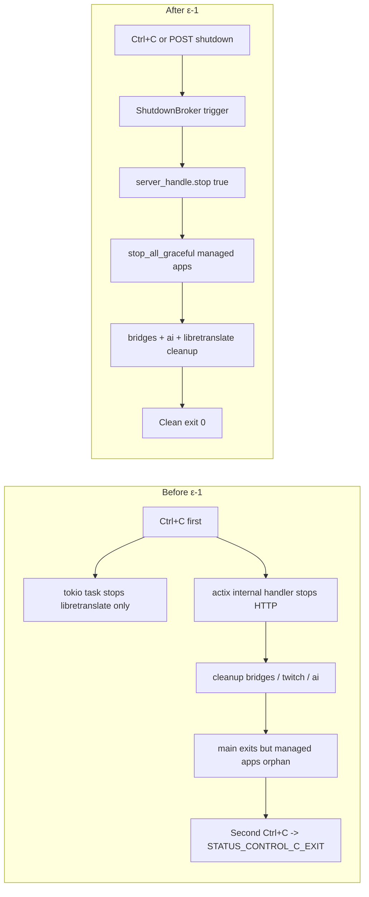

# Phase ε — Shutdown 統合と Tauri 移行段取り

**Status**: ε-1（ShutdownBroker）実装済み。ε-2（Tauri 化 / CLI 可視性ポリシー）は Windows desktop の tray + WebView first slice 実装済み。`embed-gui` release build による GUI 同梱配信も確認済み。

**Scope**: VAC の「終了処理／実行形態／CLI 可視性」にまつわる長年の小さな引っかかりを解消し、最終的に Tauri ネイティブウィンドウ動作までの地盤を作る。Phase δ（Flowgraph）と直交するメタな作業。

---

## 1. 背景

δ-9 Part E まで進んだ時点で、VAC の停止経路には以下の独立した 3 本があり、それぞれが互いを知らない状態だった。

1. **`Ctrl+C`** — `tokio::signal::ctrl_c()` で spawn した task が `state.libretranslate.stop()` を呼ぶだけ。actix-web 本体は別系統で SIGINT を拾って自前でシャットダウンする。
2. **`POST /api/v1/control/restart`** — 新プロセスを spawn したあと `std::process::exit(0)` 直叩き。cleanup は走らない。
3. **致命的エラー経路** — `?` で `run()` が Err 化した場合、cleanup を経由せずそのまま main から返る。

結果として:

- 1 回目の `Ctrl+C` で ManagedApp（`run_with` で立ち上げた CoeiroInk / VOICEVOX / LibreTranslate / Twitch EventSub 配下プロセス）が畳まれない
- 子プロセスが親の stdio を握ったまま残り、親が exit できない
- ユーザーが 2 回目の `Ctrl+C` を押すと Windows 側で強制終了となり、`STATUS_CONTROL_C_EXIT (0xc000013a)` が吐かれる
- GUI からは「穏やかな終了」手段がない（`/restart` のみ）

この 3 点を「長年の小さな違和感」として認識しつつも、δ 本丸の邪魔になる前に対処する判断を PR #XXX（本 Phase）でまとめて入れる。



---

## 2. ε-1: ShutdownBroker（実装済み）

### 2.1 目的

以下の全停止経路を **単一のブローカーに集約** することで、停止の順序・冪等性・tap point を 1 箇所で管理できるようにする。

- Ctrl+C（tokio::signal::ctrl_c）
- `POST /api/v1/control/shutdown`（本 Phase で新設）
- 将来の致命的エラー経路（`ShutdownReason::Fatal` を予約）
- 将来の Tauri `window.on_close_requested`

### 2.2 実装ポイント

- `crates/vac-core/src/shutdown.rs` に `ShutdownBroker { notify, triggered, reason }` を定義。root 側 [src/shutdown.rs](../../src/shutdown.rs) は再エクスポート。`Arc<ShutdownBroker>` を `State.shutdown` に持たせる。
- `trigger(reason)` は冪等（最初の呼び出しだけ reason を記録し waiters を起こす）。
- `wait()` は `Notify::notified()` の permit を先に取って `is_triggered()` を後追い確認する race-free パターン。
- [src/lib.rs](../../src/lib.rs) の起動冒頭で broker を生成し、`spawn_ctrl_c_listener(broker)` で Ctrl+C を 1 本化。旧 `tokio::signal::ctrl_c()` 直叩きは削除。
- [src/lib.rs](../../src/lib.rs) の `run_services` は `HttpServer::...disable_signals().run()` に切り替え、返ってきた `Server` から `handle()` を取り出して broker と関連付ける。`shutdown.wait().await` した専用 task が `handle.stop(true).await` を叩く経路を唯一の停止源にする。
- [src/web_interface/control/shutdown/mod.rs](../../src/web_interface/control/shutdown/mod.rs) に `POST /api/v1/control/shutdown` を新設し、broker を `ShutdownReason::ControlApi` で trigger するだけの薄い endpoint を置く（DTO は `shutdown/types.rs`）。

### 2.3 ManagedApp の一括停止

[src/managed_app/mod.rs](../../src/managed_app/mod.rs) に `stop_all_graceful(registry, grace_ms)` を追加。`run()` の cleanup フェーズ（`run_services` が戻ったあと）で最初に呼ぶ。

- 新規に `probe_all(&specs)` をもう一度走らせて、現時点で本当に生きている PID を取ってから `stop_entry_graceful` を順番にかける（`run_monitor` の最新ステータスが古い可能性を考慮）。
- 併せて `run_monitor` は `ShutdownBroker` を受け取って `tokio::select!` で tick と wait を race させ、停止要求で即 loop 抜けするようにした。これにより cleanup 中に監視タスクが邪魔な `ManagedAppState` イベントを吐き続けなくなる。

### 2.4 Cleanup の順序

`run()` の最終盤では、以下の順で片付ける。

1. `managed_app::stop_all_graceful(registry, 2_000)`（= `run_with` 子プロセス群を WM_CLOSE → grace → TerminateProcess で畳む）
2. `ingress_handles.twitch[*].finish()` / `flowgraph_voice_handles[*].finish()`
3. `ingress_handles.eventsub[*].abort()` / `ai_handles[*].abort()`
4. `libretranslate.stop()`（ManagedApp 経由で既に落ちている可能性が高いが、個別起動ケースに備えて保険）
5. `Ok(())` で return → プロセス終了

### 2.5 GUI 側

- [gui/src/lib/types.ts](../../gui/src/lib/types.ts) に `ShutdownRequest` / `ShutdownResponse` を追加。
- [gui/src/lib/api.ts](../../gui/src/lib/api.ts) に `controlApi.shutdown()` を追加。
- [gui/src/App.svelte](../../gui/src/App.svelte) の上部ヘッダに「終了」ボタンを追加。`window.confirm` で 1 段受け、成功時は toast を出す。停止画面は出さず、WS は自然切断に任せる（ユーザー指定の最小 UX）。

---

## 3. ε-2: Tauri 移行の段取り（first slice 実装済み）

**工程順（2026 方針）**: crate **再構造化** → **CLI / desktop の 2 runner**（単体起動・コアは lib）の詳細設計・実装 → **Tauri GUI shell を desktop runner に組み込む**。一般ユーザー向け入口・コンソール非表示・トレイ UX は desktop 側に寄せ、CLI はターミナル実行・ログ確認・本体機能開発向けに残す。正本: [`v2-vmc-and-restructure.md`](v2-vmc-and-restructure.md) §1.1、概要: [`architecture.md`](../architecture.md)「実行入口（計画・工程順）」。

### 3.1 目的

ブラウザでの Control Panel も残しつつ、**ネイティブウィンドウ動作** をオプションで選べるようにする。ユーザーの最終要求は「Tauri ネイティブ GUI ウィンドウ動作風の画面」。

ブラウザ版を捨てないのは:
- 他 PC / 他端末（スマホ含む）から LAN 経由で操作したいユースケースがある
- dev loop が速い（Vite hot reload）
- 既存 Control API / WS は HTTP 前提で作ってあり、Tauri からも同じ口を使うのが実装コストが低い

よって **Tauri は「window + system tray を被せる shell」に限定**。データパスは既存の HTTP/WS をそのまま使う。

### 3.2 前提となる事前リファクタ（ε-2a）

現 [src/lib.rs](../../src/lib.rs) の `run()` は「init → serve → cleanup」が 1 本の関数に混ざっている。Tauri の `.setup()` からは `serve` だけを別スレッドで回したいので、以下の抽出を先に行う:

```rust
pub struct AppCore {
    pub conf: Conf,
    pub state: SharedState,
    pub shutdown: Arc<ShutdownBroker>,
    pub ai_handles: Vec<JoinHandle<()>>,
    pub ingress_handles: IngressHandles,
    pub flowgraph_voice_handles: Vec<VoiceHandle>,
    pub control_api_runtime: ControlApiRuntime,
    pub flowgraph_web_input_endpoints: Arc<Vec<FlowgraphWebInputEndpoint>>,
    pub flowgraph_trigger: Arc<Option<TriggerHandle>>,
    pub web_input_registry: Arc<WebInputRegistry>,
}

impl AppCore {
    pub async fn boot(conf: Conf, audio_sink: SharedAudioSink) -> Result<Self> { .. }
    pub async fn run(self) -> AppCoreRunResult { .. /* serve + cleanup */ }
}
```

この 3 段に割ると、現 `run()` は以下で済む:

```rust
pub async fn run() -> Result<()> {
    let conf = ...;
    let core = AppCore::boot(conf, audio_sink).await?;
    core.run().await.into_result()
}
```

そして Tauri bin は `.setup()` の前に `AppCore::boot`、runtime task で `core.run()`、`on_window_event(CloseRequested)` や tray の `終了` で `ShutdownBroker` を trigger する構造に載せる。`serve` と `cleanup` の順序制御は `AppCore` 内部へ閉じる。

### 3.3 Tauri bin の追加（ε-2b）

- [Cargo.toml] に `[[bin]]` を追加して `virtual-avatar-connect-tauri` を定義。
- `cargo features`: `tauri = ["dep:tauri"]` を default off に。
- Windows では `#![cfg_attr(not(debug_assertions), windows_subsystem = "windows")]` を付けて、リリースビルド時はコンソールを出さない。dev ビルドでは付けないので開発中は従来通りログが流れる。
- Tauri window の初期 URL は `http://127.0.0.1:<actix port>`。既存の GUI 静的配信（`gui_dist_path`）をそのまま見せる。
- `on_window_event(CloseRequested)`: `api.prevent_close()` で 1 段止めて `shutdown.trigger(Tauri)` → `cleanup().await` 待ち → `app.exit(0)`。

### 3.4 System Tray（ε-2c, オプション）

- 最小: 「Restart / Shutdown / Show Window」3 項目のみ。
- `shutdown.trigger(Tauri)` で統一する。tray の Shutdown と window の close は同じコードパスに流す。

### 3.5 IPC 方針

- **Tauri `invoke` は原則使わない**。Tauri 内の WebView も `fetch('/api/v1/control/...')` で既存 HTTP API を叩く。
- 例外は「初回ロード時に conf path / token 取得」など、HTTP ポートが使えるようになる前に必要な情報だけ。その場合だけ `invoke('get_bootstrap')` のような薄い bridge を 1 本だけ置く。
- これにより「Tauri shell」「ブラウザ（LAN 越し）」で同じ GUI コードを共有できる。

### 3.6 GUI 静的成果物の内蔵（設計メモ）

**目的**: エンドユーザーが **`npm run dev` を起動しない**まま、Tauri WebView および **CLI 経由の actix** から既存 Control Panel を開けるようにする。

- **ソース**: 引き続き `gui/` で Svelte を編集し、CI／リリース前に `npm run build` で `gui/dist` を生成する。
- **取り込み**: `gui/dist` を **ビルド時**に Rust 側へ埋め込む（`vac-gui-assets` 的 crate、`rust-embed`、`build.rs` 生成、`include_dir!` 等。詳細は実装時に [`v2-vmc-and-restructure.md`](v2-vmc-and-restructure.md) §1.2）。
- **Tauri**: first slice では WebView の初期 URL を loopback の `/gui/` にし、**リリース**では `embed-gui` feature により actix が同梱静的を返す。custom protocol は後続の最適化候補であり、Control API / WS は引き続き loopback HTTP を使う。

配布用の基準コマンド:

```powershell
cargo build --release --features embed-gui
```

この build で `virtual-avatar-connect-cli.exe` / `virtual-avatar-connect-desktop.exe` の 2 本だけが生成され、desktop 側は tray + Tauri WebView で `/gui/` を開く。
- **actix**: ディスクの `gui_dist_path` ではなく **埋め込みバイト列**から `index.html` / アセットを返す実装を追加すれば、**CLI 単体**でも同じ UI を配信できる。

開発時は従来どおりファイルシステムや Vite を指す経路を残す（feature 分岐）。

---

## 4. CLI 可視性ポリシー（未着手）

### 4.1 現状

Windows では `#[actix_web::main]` がコンソールサブシステムで走り、ターミナルから起動すると常にログが流れる。`start` コマンドで起動した場合や `explorer.exe` からダブルクリック起動した場合は新規コンソールが付く。

開発者は「生ログを見ながら走らせたい」、一般ユーザーは「GUI だけ出ればいい」。同じバイナリで両方やると折衷になる。

### 4.2 選択肢

1. **現状維持 + `--silent` 引数** — log level を WARN 以上に落として「事実上見せない」だけ。コンソールウィンドウは残る。
2. **`#![cfg_attr(not(debug_assertions), windows_subsystem = "windows")]`** — リリースビルドだけウィンドウサブシステムに切り替え。dev は console が出る。ただしリリースビルドでターミナルから起動しても stdout がどこにも繋がらない欠点あり。
3. **2 バイナリ分岐** — `virtual-avatar-connect-cli.exe`（console 付き CLI）と `virtual-avatar-connect-desktop.exe`（windowed, tray 常駐, Tauri 同梱）の 2 系統。配布時は desktop 版がメイン、CLI 版は power user / developer 向け。
4. **動的 `AttachConsole(ATTACH_PARENT_PROCESS)`** — windowed サブシステムで起動しつつ、親がターミナルなら stdout を繋ぎ直す。実装が Windows specific かつ fragile。

### 4.3 推奨

**Tauri 導入と同時に (3) を採用**（2 バイナリ: CLI = コンソール付き、desktop = windowed + tray 常駐 + Tauri WebView）。CLI は従来型の API / ログ / 開発 runner として残し、desktop は tray 常駐を本体にする。再構造化後の **desktop / CLI runner** 方針（[`v2-vmc-and-restructure.md`](v2-vmc-and-restructure.md) §1.1）とまとめて進めるのがよい。それまでは (1) の `--silent` だけ先行実装してもよい（`cargo features` を切らずに動ける）。動的 console 切替 (4) は、よほど運用上困ったら検討する、くらい。

---

## 5. 今回スコープ外（明示）

- `AppCore` 抽出リファクタ（§3.2）。Tauri 着手時にまとめる。
- `--silent` / windows subsystem 切替（§4.2 の 1,2,3,4）。
- GUI の停止画面 / `window.close()` 試行。ユーザー指定で最小 UX（API 呼んで toast だけ）に留めた。
- Ctrl+C で GUI セッション状態を保存する仕組み。
- 致命的エラー時の強制 cleanup。`?` で落ちる経路には `ShutdownReason::Fatal` で trigger する仕組みが必要だが、今回は broker 定義だけで呼び出し側の配線は行っていない。

---

## 6. 手動検証

### 6.1 Ctrl+C

- `cargo run -- conf.local.solo.toml` で起動
- `Ctrl+C` を 1 回押す
- 期待: ターミナルに `《Shutdown》 トリガ受信: reason=ctrl_c` → `actix HTTP サーバーへの graceful stop を要求します` → `ManagedApp 全停止を試行します` → `cleanup 完了。プロセスを終了します` と順に出て、プロンプトに戻る
- 期待: `0xc000013a` が出ない / Task Manager で CoeiroInk などが消えている

### 6.2 GUI 終了ボタン

- GUI 上部ヘッダの「終了」ボタンを押す
- 期待: confirm ダイアログで OK → トースト「アプリ停止を要求しました」→ 数秒後に WS が切れて ConnectionBadge が disconnected 表示

### 6.3 POST 直叩き

- Bruno などから `POST http://127.0.0.1:57000/api/v1/control/shutdown` （loopback なので token 不要）
- 期待: 202 Accepted + `{ status: "shutting_down", current_pid: <pid> }`
- 期待: サーバ側ログで Ctrl+C 同等の終了シーケンス
