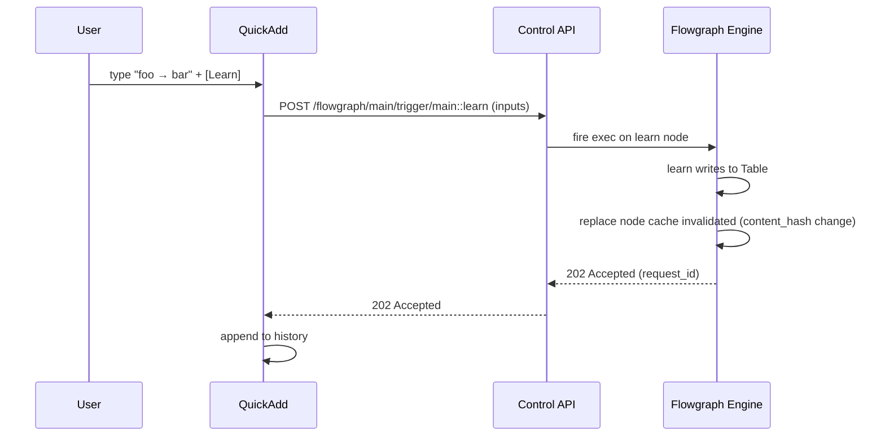

# Phase φ — Control API for Tables + Dictionary Editor / Live Quick-Add

> η で復活した `flowgraph.dictionary.*` / `flowgraph.table.*` を、GUI から編集・即時学習できるようにするフェーズ。
> Control API に「Table ファイル CRUD」と「Flowgraph ノード外部トリガ」の 2 系統を追加し、
> V1 時代に存在した `γ-8` Dictionary Editor と `DictionaryQuickAddWidget` を V2 向けに再構築する。
> 本仕様書は実装前の設計固定ドキュメントであり、φ-0 で取り込まれる。実装は φ-1 以降で順次進める。

---

## 1. Background

### 1.1 η-6 で保留された 2 機能

η フェーズ末（[phase-eta-dictionary-unification.md §9.2 / §9.3](phase-eta-dictionary-unification.md)）で以下 2 機能が「φ 以降」に明示的に繰り越された:

- **Dictionary Editor pane**: 11 カラム表 UI による TSV 直接編集（sortable / filterable、`is_locked` 保護、期限切れグレーアウト）
- **Live Quick-Add Widget**: Twitch チャンネルポイント連携想定の小型 UI。「学習（source → replacement）」を 1 クリックで `dictionary.learn` ノードに trigger 投入し、UNDO（Forget latest）ボタンで取り消し

保留の直接理由は **Control API 側の不足**:

1. ディスク上の TSV を Flowgraph runtime と独立に読む／書く API が無い
2. Flowgraph の特定ノード（Learn / Forget など）に外部から exec を打ち込む API が無い
3. 「GUI から編集して良い TSV ファイル」の allow-list 機構が無い（任意パス許可は危険）

### 1.2 V1 `γ-8` dead code 経緯

- V1 `γ-8` で実装された Dictionary Editor と `DictionaryQuickAddWidget.svelte` は `modify` processor の runtime 状態を直接触る前提だった
- V2 δ-9 で `modify` processor が撤去された結果、両 Svelte コンポーネントは dead code 化して削除済み
- V2 では「辞書は `.dict.tsv` ファイル」「`dictionary.replace` ノードが読み込み、`dictionary.learn` / `.forget` が mutation」という疎結合構造になったため、**GUI は Flowgraph の内部を知らずに「ファイル」と「ノード trigger」だけを扱えば済む**

### 1.3 φ の目標

- η で固めた 11 カラム Table を GUI からも安全に編集できる
- Quick-Add で Flowgraph を動的に揺らせる（辞書の即時学習／忘却）
- 任意ファイル編集の事故を防ぐ allow-list を conf に固定
- 楽観ロック（blake3 content hash）で「同時編集による巻き戻し」を検出
- Dictionary 以外の Table（scene registry、credential store など θ 以降の想定用途）にも**同じ API**で対応する

---

## 2. Goals / Non-Goals

### 2.1 Goals

- `[control.tables]` allow-list に登録された TSV ファイルに対する full CRUD
- Flowgraph Runtime 実行中インスタンスの指定ノードへの exec 外部トリガ
- 11 カラム Table の GUI Editor（sortable / filterable、`is_locked` 保護）
- Live Quick-Add Widget による 1-click 学習と UNDO（直近 Forget）
- 楽観ロック (`If-Match: <blake3-hex>`) による巻き戻し検知
- **複数 Flowgraph instance** 対応（instance_id で区別）
- Dictionary 専用ではなく **汎用 Table** に対する操作として設計（scene registry、twitch user list 等に将来流用）

### 2.2 Non-Goals（φ では扱わない）

- 同時編集の悲観ロック（サーバ側 mutex を持たず、楽観ロックの失敗時は 409 で client 再取得）
- 辞書差分のクラウド同期・遠隔レプリケーション
- Undo 履歴のサーバ側永続化（client 側メモリのみ、ページリロードで消える）
- Flowgraph トポロジーそのものの GUI 編集（これは既存の `/control/flowgraph/*` file API の仕事）
- Quick-Add 履歴の multi-user 共有
- Table の全文検索（`source` 部分一致のみ、ILIKE 相当）

---

## 3. Control API — Table File Endpoints

既存 [src/web_interface/control/flowgraph.rs](../../src/web_interface/control/flowgraph.rs) と同じ scope (`/api/v1/control/*`) 内に、新ファイル `src/web_interface/control/table.rs` を追加する想定。

### 3.1 `GET /control/table/{fq_path}`

**用途**: 11 カラム TSV をパースして行 ID 付き JSON で返す。

**パラメータ**:
- Path `fq_path`: `{profile}::{relative_path}` 形式。例: `main::dictionary.chat.dict.tsv`。[src/web_interface/control/flowgraph.rs](../../src/web_interface/control/flowgraph.rs) の `get_file` と同じエンコード規則

**レスポンス例**:

```json
{
  "fq_path": "main::dictionary.chat.dict.tsv",
  "content_hash": "b3:8a7f2e...",
  "entries_count": 49,
  "entries": [
    {
      "row_index": 0,
      "source": "ウサギネットワーク",
      "replacement": "USAGI.NETWORK",
      "kind": "literal",
      "priority": 0,
      "is_locked": false,
      "enabled": true,
      "by": "chat",
      "created_at": "2026-04-22T18:33:22Z",
      "expires_at": null,
      "tags": "dictionary.chat",
      "note": "migrated from dictionary.chat.txt"
    }
  ]
}
```

**エラー**:
- `404 NotFound`: ファイル未登録 or allow-list 外
- `422 SchemaMismatch`: TSV パース失敗（列数不足 / header 欠落）

### 3.2 `PUT /control/table/{fq_path}`

**用途**: TSV 全体を置換（Editor での bulk save 想定）。

**リクエストヘッダ**: `If-Match: b3:<hex>` 必須。サーバ側現行 `content_hash` と一致しない場合は 409。

**リクエストボディ**: `GET` と同形式の JSON（`entries` の配列）。サーバは 11 カラムに serialize して atomic write。

**エラー**:
- `409 OptimisticLockFailed`: content_hash mismatch
- `403 Locked`: `is_locked=true` 行を削除 / 改変しようとした場合（新規 entry の `is_locked=true` はセット可）
- `422 SchemaMismatch`: 必須列の欠落 / 型違反

### 3.3 `POST /control/table/{fq_path}/entry`

**用途**: 1 行 append。Quick-Add の素朴な経路。

**リクエストボディ**: `TableEntryDto`（`row_index` 以外）。`by` / `created_at` は未指定ならサーバが補完（`by` は認証トークンのラベル、`created_at` は現在時刻）。

**レスポンス**: 新 `row_index` と更新後 `content_hash`。

**ヘッダ**: `If-Match` は**省略可**。省略時は「最後に read した content_hash を知らない」ので競合検出はスキップされる。append は冪等ではないので client 側で dedupe。

### 3.4 `PATCH /control/table/{fq_path}/entry/{row_index}` / `DELETE /control/table/{fq_path}/entry/{row_index}`

**用途**: 1 行の部分更新 / 削除。`is_locked=true` 行は `DELETE` / `is_locked` の downgrade ともに 403。

**ヘッダ**: `If-Match` 必須。

### 3.5 DTO 定義

[src/web_interface/control/dto.rs](../../src/web_interface/control/dto.rs) に以下を追加:

```rust
#[derive(Serialize, Deserialize)]
pub struct TableFileDto {
    pub fq_path: String,
    pub content_hash: String, // "b3:<hex>"
    pub entries_count: usize,
    pub entries: Vec<TableEntryDto>,
}

#[derive(Serialize, Deserialize)]
pub struct TableEntryDto {
    pub row_index: usize,
    pub source: String,
    pub replacement: String,
    pub kind: String,       // "literal" | "regex"
    pub priority: i64,
    pub is_locked: bool,
    pub enabled: bool,
    pub by: Option<String>,
    pub created_at: Option<String>, // RFC3339
    pub expires_at: Option<String>,
    pub tags: Option<String>,
    pub note: Option<String>,
}
```

### 3.6 エラーコード

[src/web_interface/control/flowgraph.rs](../../src/web_interface/control/flowgraph.rs) の既存 diagnostic error style に合わせ:

- `404 NotFound` — allow-list 外 / ファイル不在
- `403 Locked` — locked 行への破壊的操作
- `409 OptimisticLockFailed` — content_hash mismatch
- `422 SchemaMismatch` — TSV parse error / DTO 列型違反
- `500 Io` — ディスク I/O 失敗

---

## 4. Control API — Flowgraph Trigger Endpoint

### 4.1 `POST /control/flowgraph/{instance_id}/trigger/{node_id}`

**用途**: 実行中 Flowgraph インスタンスの特定ノードの `exec_in` を外部発火する。Quick-Add → `dictionary.learn` / `dictionary.forget` の即時起動を主眼とする。

**パラメータ**:
- Path `instance_id`: 実行中インスタンスの ID。V2 では単一インスタンスしか動かないケースが多いが、複数プロファイル同時実行を将来サポートするため path に含める。既定値 `default`
- Path `node_id`: FQ 形式の node ID（`main::learn` 等）

**リクエストボディ**:

```json
{
  "inputs": {
    "source": { "type": "string", "value": "ドクターウサギ" },
    "replacement": { "type": "string", "value": "DR.USAGI" },
    "kind": { "type": "string", "value": "literal" },
    "priority": { "type": "int", "value": 0 },
    "by": { "type": "string", "value": "quick-add" }
  }
}
```

各値は [src/flowgraph/socket.rs](../../src/flowgraph/socket.rs) の `SocketValue` にマップ可能な DTO（既存 `from_toml_value` のロジックを再利用、JSON 版を追加）。

**動作**:
1. runtime から `instance_id` の engine を解決
2. `node_id` が `NodeImpl::Pure` or `Stateful` で exec 入力ポートを持つことを validate
3. `inputs` を一時的にそのノードの入力 socket に bind し、exec を 1-shot 発火
4. 発火結果（成功／失敗、ノード内で発生したログ）を 202 Accepted + request-id で返す。実行自体は engine task に委譲し同期応答しない

**エラー**:
- `404 NotFound` — instance or node
- `400 InvalidPort` — trigger 先ノードが exec 入力を持たない
- `422 InputMismatch` — `inputs` の型が socket 要求型と違う

### 4.2 トリガ対象ノードの必要条件

安全に呼び出せるノードは以下を満たすものに限定する（Control API 側で whitelist 判定）:

- `NodeImpl::Pure` または `NodeImpl::Stateful`（`Effectful` も許容するが警告付き）
- `exec_in` 相当の入力ポートを 1 つ以上持つ
- Node descriptor に `#[control_triggerable]` 相当の opt-in mark（実装は `NodeSpec.control_triggerable: bool` を追加、既定 false）

`dictionary.learn` / `dictionary.forget` / `table.write_tsv` / `channel.emit` あたりを想定 opt-in 対象とする。

---

## 5. File Registry — `[control.tables]` allow-list

GUI から編集可能な TSV を誤爆から守るため、`conf.toml` に **allow-list** を新設する。

### 5.1 conf スキーマ

```toml
[control]
# ... 既存 [control] の設定 ...

[[control.tables]]
fq_path   = "main::dictionary.chat.dict.tsv"
label     = "Chat Dictionary"
role      = "dictionary"          # "dictionary" | "scene-registry" | "generic"
editable  = true
quick_add = { node_id = "main::learn", kind = "literal" }

[[control.tables]]
fq_path   = "main::dictionary.pre-coeiroink.dict.tsv"
label     = "Pre-CoeiroInk Readings"
role      = "dictionary"
editable  = false                # 表示のみ、PUT/PATCH/DELETE は 403

[[control.tables]]
fq_path   = "main::scene-registry.table.tsv"
label     = "Scene Registry"
role      = "scene-registry"
editable  = true
```

### 5.2 セマンティクス

- `editable=false` → `GET` のみ許可、`PUT` / `PATCH` / `DELETE` / `POST /entry` は 403
- `quick_add` が定義されていれば GUI に Quick-Add widget を表示、未定義なら Editor pane のみ
- 登録されていない fq_path への Control API アクセスは 404（存在そのものを隠す）
- `role` は GUI カテゴリ分けに使う（`dictionary` → Dictionary Editor pane、`scene-registry` → Scene Table pane 等）

### 5.3 conf 型の追加位置

[src/conf/mod.rs](../../src/conf/mod.rs) の `[control]` 関連 struct に `ControlTablesConf` を追加:

```rust
#[derive(Debug, Clone, Deserialize, Serialize)]
pub struct ControlTableEntry {
    pub fq_path: String,
    pub label: String,
    pub role: ControlTableRole,
    #[serde(default = "default_true")]
    pub editable: bool,
    #[serde(default)]
    pub quick_add: Option<ControlTableQuickAdd>,
}
```

---

## 6. GUI — Dictionary Editor Pane

### 6.1 配置

- ルート: `gui/src/lib/control/dictionary/` 新設
- 呼び出し元: Live Tab の既存 accordion に「Dictionary」セクションを追加
- allow-list `role=="dictionary"` の Table ごとに別 tab で表示

### 6.2 コンポーネント構成

```
DictionaryEditorPane.svelte      ← root、tab 切替
  ├─ DictionaryTable.svelte       ← 11 カラム表（sortable / filterable）
  ├─ DictionaryEntryForm.svelte   ← 新規 / 編集ダイアログ
  └─ DictionaryConflictDialog.svelte ← 楽観ロック競合時の merge UI
```

### 6.3 UX 仕様

- **列**: source / replacement / kind badge / priority / locked icon / enabled toggle / tags / expires chip / note / (操作列)
- **ソート**: クリックで列ソート（フロント側、pageable）
- **フィルタ**: キーワード（source 部分一致）、kind 絞り込み（literal / regex）、tag 絞り込み
- **is_locked**: 行背景グレー + 南京錠アイコン、削除ボタン無効化（hover で「ロックされています」toast）
- **expires_at が過去**: 行全体グレーアウト（tooltip に `Expired at ...`）
- **enabled=false**: 行を薄く表示
- **バルク編集**: チェックボックス選択 → 一括 enable/disable。削除は 1 件ずつ

### 6.4 データフロー

```mermaid
sequenceDiagram
  participant U as User
  participant E as Editor Pane
  participant API as Control API
  participant FS as Disk (TSV)

  U->>E: open pane
  E->>API: GET /control/table/{fq}
  API->>FS: read TSV + blake3
  API-->>E: TableFileDto (hash=H0)

  U->>E: edit row #3 + Save
  E->>API: PATCH /entry/3  If-Match: H0
  API->>FS: read again, check hash
  alt hash matches
    API->>FS: rewrite row, atomic write
    API-->>E: 200 OK (hash=H1)
  else hash mismatch
    API-->>E: 409 Conflict (current=TableFileDto H2)
    E->>U: show conflict dialog, ask merge
  end
```



### 6.5 conflict dialog

- 3-way diff を表示（元の値 / 自分の編集 / サーバ現行）
- 「自分の編集を強制」「サーバ現行を採用」「手動 merge」の 3 ボタン
- 手動 merge 選択時は row-level の選択 UI を提示

---

## 7. GUI — Live Quick-Add Widget

### 7.1 配置

- Live Tab のヘッダ常駐 `<DictionaryQuickAdd />`（V1 `DictionaryQuickAddWidget.svelte` の再実装）
- `allow-list` に `quick_add` を持つ Table の数だけタブ化（普通は 1 つ）

### 7.2 UI

- 1 行フォーム: `source` input + `→` + `replacement` input + `[Learn]` button
- `kind` は `quick_add.kind`（literal / regex）で決め打ち、切替は expanded menu
- 直近 10 件の履歴を dropdown 表示
- 各履歴行に `[Undo]` ボタン → 対応する forget trigger を発火

### 7.3 トリガフロー



### 7.4 UNDO 実装

- 履歴各行に `forget` 用の payload を保持（同じ source / kind）
- `[Undo]` 押下で `POST /flowgraph/main/trigger/main::forget (mode=latest, source=...)` を発火
- サーバ側 `forget` ノードの `is_locked` 保護があるので locked 行の undo は不可（409 相当で toast）

---

## 8. Flowgraph instance ID / node_id 解決

### 8.1 instance_id 採番

- 現行 V2 は `State` が単一 engine を持つ前提。既定 instance_id = `default`
- 将来のマルチプロファイル同時実行では profile 名を instance_id として使う
- API 実装は [src/state/mod.rs](../../src/state/mod.rs) の engine 格納部分に `HashMap<InstanceId, EngineHandle>` を追加（φ-2 の実装タスク）

### 8.2 node_id

- `LoadReport.node_meta` の key 形式 (`{profile}::{node_id}`) をそのまま API の `node_id` path に使う
- GUI 側は `GET /control/flowgraph/tree` で取得できる node meta から `control_triggerable=true` のノードだけを Quick-Add の配線候補に出す

### 8.3 Node descriptor への opt-in mark

[src/flowgraph/node.rs](../../src/flowgraph/node.rs) の `NodeSpec` に `control_triggerable: bool` を追加:

```rust
pub struct NodeSpec {
    pub feature: String,
    // ... existing fields ...
    pub control_triggerable: bool,  // default false
}
```

既存ノードは全て false、`dictionary.learn` / `.forget` / `table.write_tsv` / `channel.emit` のみ `true` に変更する。

---

## 9. Security / 認証

- 既存 [ControlApiRuntime](../../src/web_interface/control/auth.rs) の Bearer トークン認証を**そのまま流用**
- allow-list 外パスは 404（存在隠蔽）
- `is_locked=true` 行の破壊的操作は 403
- Trigger API は `control_triggerable=true` のノードに限定。任意ノード trigger は許さない
- 楽観ロックのみ（悲観ロックなし）
- 同時編集の race window は「read → edit → write」の間のみ。通常使用で 1 秒未満、衝突時は UI で解決

---

## 10. Test Plan

### 10.1 Unit (Rust `cargo test`)

- `src/web_interface/control/table.rs`:
  - `GET` roundtrip（書いた内容がそのまま返る）
  - `PUT` with correct If-Match → 200, with wrong → 409
  - `POST /entry` append → row_index が正しく採番
  - `DELETE` on `is_locked=true` → 403
  - allow-list 外パス → 404
- `src/web_interface/control/flowgraph_trigger.rs`:
  - `control_triggerable=false` のノードに対する POST → 400
  - `instance_id` 不明 → 404
  - inputs の型 mismatch → 422
- `src/flowgraph/nodes/dictionary.rs`:
  - `learn` 外部 trigger 後に `replace` の `content_hash` が変わる（キャッシュ invalidation 確認）

### 10.2 Integration (playwright-cli 想定)

- Editor で 1 行編集 → Save → 再 load で反映確認
- Quick-Add で Learn → replace 出力に即時反映（ライブ）
- 2 タブで同時編集 → 片方で 409 + conflict dialog が出る

### 10.3 Smoke (cargo test で固定化)

- allow-list に 2 件登録した conf から起動 → `GET /control/tables` が 2 件を返す
- Trigger API POST → 202 が返り、engine 側で該当 request_id が記録される

---

## 11. Open Questions / Future Extensions

- **Multi-profile 同時実行**: `instance_id` 採番ルール（profile 名そのまま？衝突回避は？）は θ 以降の「複数 Flowgraph 並行実行」設計と合わせて決める
- **Table 変更通知 WebSocket**: `/ws/control` の既存チャネルに `table.changed` イベントを流し、複数タブ間で editor が自動リロードされる仕組み。φ では client 側 polling で妥協するか要検討
- **Quick-Add の history 永続化**: client 側 `localStorage` で十分か、server 側 `~/.vac/quickadd.history.jsonl` を作るか
- **Bulk import / export**: Editor から CSV / JSON エクスポート、他プロファイルからのインポート
- **Scene Registry / Credential Store**: `role="scene-registry"` などは φ では DTO とルーティングだけ通し、GUI Pane は θ で実装
- ~~**Flowgraph topology 可視化への trigger 統合**: Flowgraph Editor キャンバス上で `control_triggerable=true` のノードに "Trigger" ボタンを出し、dev 用の手動発火手段を提供（θ 候補）~~ → **φ-6 で実装済み**（`FlowgraphNodeCard.svelte` に ▶ ボタン、`FlowgraphTriggerDialog.svelte` で inputs を手入力）。node-catalog JSON に `control_triggerable` フィールドを注入して GUI が判別できるようにした

---

## 12. References

- 保留元: [phase-eta-dictionary-unification.md §9.2 / §9.3](phase-eta-dictionary-unification.md)
- 既存 Control API 実装: [src/web_interface/control/](../../src/web_interface/control/) 配下、特に [flowgraph.rs](../../src/web_interface/control/flowgraph.rs) / [auth.rs](../../src/web_interface/control/auth.rs) / [dto.rs](../../src/web_interface/control/dto.rs)
- V1 死体: 過去 `gui/src/lib/DictionaryQuickAddWidget.svelte`（`modify` processor 前提で dead code 化、V2 δ-9 で削除）
- Flowgraph node spec: [src/flowgraph/node.rs](../../src/flowgraph/node.rs)、[src/flowgraph/registry.rs](../../src/flowgraph/registry.rs)
- 関連メモ: [v2-merge-pr.md](v2-merge-pr.md) の η→φ 移行計画
- ユーザ向け解説: [manual/tutorials/dictionary-editor-and-quick-add.md](../manual/tutorials/dictionary-editor-and-quick-add.md)（φ-5 追加）
- conf リファレンス §5.1: [manual/conf-reference.md](../manual/conf-reference.md#51-control_apitables--辞書--汎用-table-の-gui-編集許可リスト-phase-φ)
